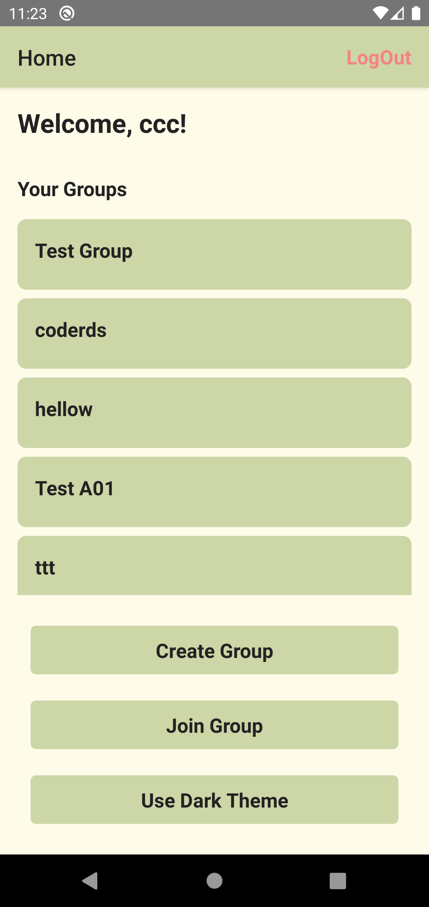
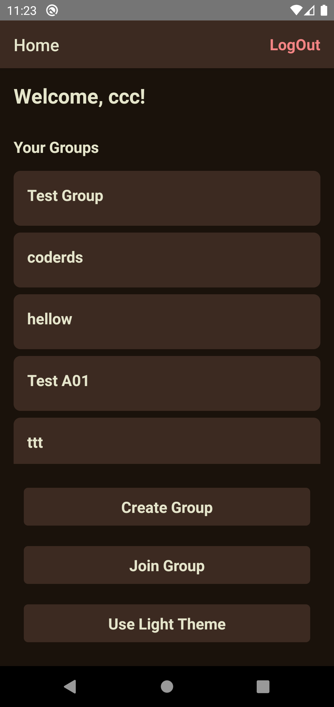

# Chat App

This is a chat app built with React Native and Firebase.

## Features

- User authentication with email and password.
- Users can create/join a group and send messages in real-time.
- Users can search for groups by name and join them.
- Dark mode and light mode theme support.
- Logout functionality.

## Screenshots

- React Native
- Firebase

## Getting Started

### Prerequisites

- Node.js (v14.15.0 or later)
- npm (v6.14.8 or later)
- React Native CLI ( latest )
- Firebase project with Firestore and Authentication enabled

### Installing

1. Clone the repository and navigate to the project directory:

<pre>

bash<button class="flex ml-auto gap-2"><svg stroke="currentColor" fill="none" stroke-width="2" viewBox="0 0 24 24" stroke-linecap="round" stroke-linejoin="round" class="h-4 w-4" height="1em" width="1em" xmlns="http://www.w3.org/2000/svg"><path d="M16 4h2a2 2 0 0 1 2 2v14a2 2 0 0 1-2 2H6a2 2 0 0 1-2-2V6a2 2 0 0 1 2-2h2"></path><rect x="8" y="2" width="8" height="4" rx="1" ry="1"></rect></svg>Copy code</button>

<code class="!whitespace-pre hljs language-bash">git clone https://github.com/your-username/chat-app.git
cd chat-app
</code>

</pre>

2. Install dependencies:

<pre>

<button class="flex ml-auto gap-2"><svg stroke="currentColor" fill="none" stroke-width="2" viewBox="0 0 24 24" stroke-linecap="round" stroke-linejoin="round" class="h-4 w-4" height="1em" width="1em" xmlns="http://www.w3.org/2000/svg"><path d="M16 4h2a2 2 0 0 1 2 2v14a2 2 0 0 1-2 2H6a2 2 0 0 1-2-2V6a2 2 0 0 1 2-2h2"></path><rect x="8" y="2" width="8" height="4" rx="1" ry="1"></rect></svg>Copy code</button>

<code class="!whitespace-pre hljs">npm install
</code>

</pre>

3. Run Emulator:

   Run an Android Emulator

4. Run the app:

<pre>

shell<button class="flex ml-auto gap-2"><svg stroke="currentColor" fill="none" stroke-width="2" viewBox="0 0 24 24" stroke-linecap="round" stroke-linejoin="round" class="h-4 w-4" height="1em" width="1em" xmlns="http://www.w3.org/2000/svg"><path d="M16 4h2a2 2 0 0 1 2 2v14a2 2 0 0 1-2 2H6a2 2 0 0 1-2-2V6a2 2 0 0 1 2-2h2"></path><rect x="8" y="2" width="8" height="4" rx="1" ry="1"></rect></svg>Copy code</button>

<code class="!whitespace-pre hljs language-sql"> npx react-native run-android</code>

</pre>

## Contributing

Pull requests are welcome. For major changes, please open an issue first to discuss what you would like to change.

## License

This project is licensed under the MIT License - see the [LICENSE.md](https://chat.openai.com/chat/LICENSE.md) file for details.
